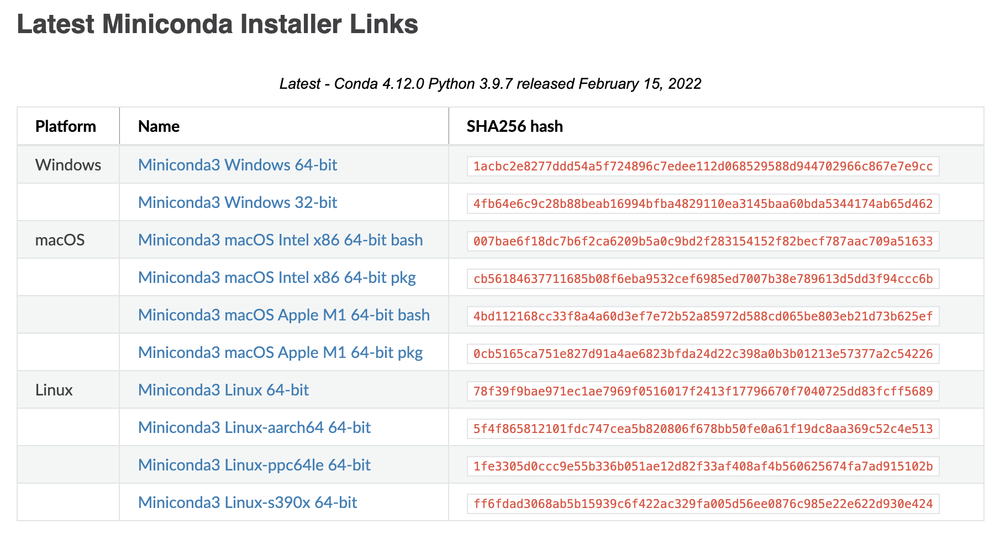
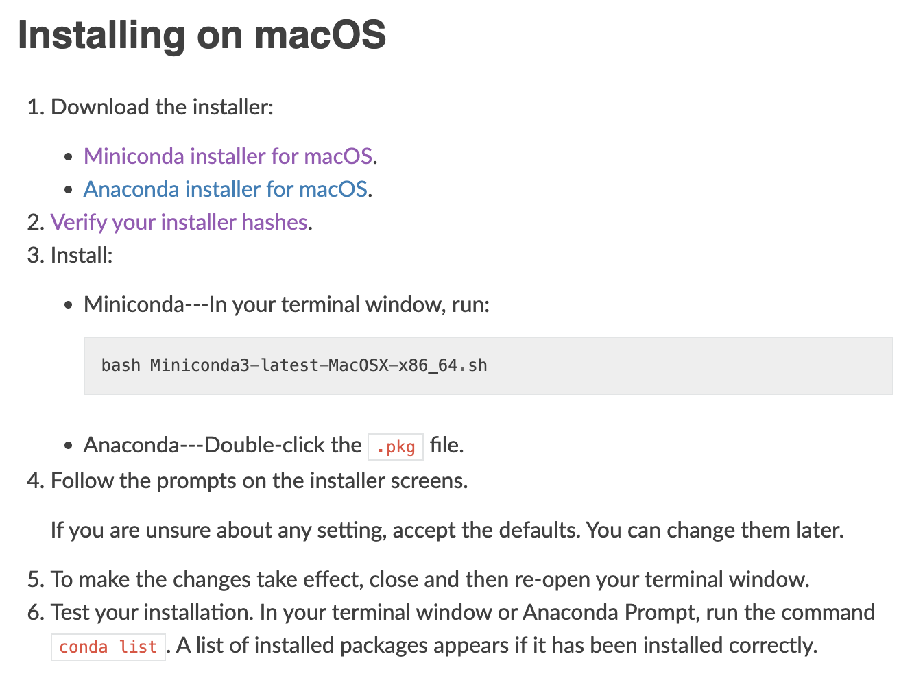

# Installing Python

## Table of contents

- [Before you start](#before-you-start)
- [Installing from python.org](#installing-from-pythonorg)
- [Installing via miniconda](#installing-via-miniconda)
- [Installing via Homebrew](#installing-via-homebrew)
- [Creating a standalone environment (optional)](#creating-a-standalone-environment-optional)

## Before you start

- Whenever I say Python in this tutorial, I mean Python 3.*. **DO NOT INSTALL Python 2.\***.
- I introduce three ways to install Python. Decide which one is better after at least skimming through all of them, unless you already know which one you want to use.
- In this tutorial, I focus on macOS. If you are using other operating systems, you can still follow along, but you might need to do some extra work or do it slightly differently based on the links I provide.

## Installing from python.org

**Note**: Sometimes you machine (e.g., with macOS) comes with a pre-installed copy of Python. If that is the case, you should still install a new Python copy, because the pre-installed one might serve as a part of your operating system, and it's not recommended to mess with it.

The simplest way to install Python is to directly download the installation package matching your operating system and architecture from [python.org](https://www.python.org/). This is strongly recommended for those who have not installed Python on their machines and want a painless installation process. Once you have finished, open your terminal and type `python3 -c "import this"`. This command directly executes the Python code in the quotation marks. If you see no error message and the same output like below, it means your installation is successful.

```text
❯ python -c "import this"
The Zen of Python, by Tim Peters

Beautiful is better than ugly.
Explicit is better than implicit.
Simple is better than complex.
Complex is better than complicated.
Flat is better than nested.
Sparse is better than dense.
Readability counts.
Special cases aren't special enough to break the rules.
Although practicality beats purity.
Errors should never pass silently.
Unless explicitly silenced.
In the face of ambiguity, refuse the temptation to guess.
There should be one-- and preferably only one --obvious way to do it.
Although that way may not be obvious at first unless you're Dutch.
Now is better than never.
Although never is often better than *right* now.
If the implementation is hard to explain, it's a bad idea.
If the implementation is easy to explain, it may be a good idea.
Namespaces are one honking great idea -- let's do more of those!
```

If you installed Python in this way, you are settled, and go ahead to play with the language by entering the Python prompt by executing `python` in your terminal. If you want to install Python in a more customized way, read on.

## Installing via miniconda

If you have experience with data science, you might have also heard of [Anaconda](https://www.anaconda.com/), another package manager that can install Python (and more than that). Here, I'll use [miniconda](https://docs.conda.io/en/latest/miniconda.html), a minimal version of Anaconda, as an example. If you want to know the difference between Anaconda and miniconda, check out this [page](https://docs.conda.io/projects/conda/en/latest/user-guide/install/download.html#anaconda-or-miniconda) and this [blog post](https://jakevdp.github.io/blog/2016/08/25/conda-myths-and-misconceptions/).

Go to miniconda's [homepage](https://docs.conda.io/en/latest/miniconda.html), and select the installer matching your platform (i.e., operating system) and architecture. For example, if you have a Mac with an M1 chip, choose either `Miniconda3 macOS Apple M1 64-bit bash` or `Miniconda3 macOS Apple M1 64-bit pkg`. The `bash` installer is a command line installer, whereas the `pkg` suffix means it is a graphical installer. If you are not familiar with command line, the later is recommended.



Once you have downloaded the installer, go to the [installation instruction page](https://conda.io/projects/conda/en/latest/user-guide/install/index.html). Under "Regular installation," choose your operating system. For macOS, the page assumes you downloaded the command line installer with `bash` suffix, and you can accept most of the defaults (unless you know a certain default is not what you want). The same applies to a graphical installer.

**Note**: You can skip step 2 in the instruction below, as that does not change your installation.



<!-- If you choose to use miniconda as your Python installer, the best practice is to create an environment instead of operating on the default environment (i.e., no environment). This is especially important if you want to upgrade Python or install a version different from the one you have. [This page](https://conda.io/projects/conda/en/latest/user-guide/tasks/manage-python.html#updating-or-upgrading-python) might be helpful if you want to do so. -->

## Installing via Homebrew

Homebrew is also an option if you use macOS, but I won't go into details here. If you are interested, check out their [installation page](https://brew.sh/).

## Creating a standalone environment (optional)

There is nothing "wrong" with using an out-of-the-box Python, but it is sometimes better to use an "environment," which can be considered as a container that is safe enough for you to play with. In fact, **it is always a best practice to use a (virtual) environment** (read [this](https://snarky.ca/why-you-should-use-python-m-pip/) if you want to know why). The benefit of using an environment might not be obvious in this course, but you'll see it in more advanced usage involving multiple Python versions and packages. For example, people sometimes create a new environment specific to a project, so that they can easily switch between different projects without messing up the dependencies (you'll learn about this later).

For CSE 20, the course itself can be treated a project, and when you later take other courses that require you to write Python code, you can create individual environments for each of those courses (or each project within a single course if you like). When you interact with Python in a particular environment, most of what you do will not affect the state of other environments. This can be helpful if you accidentally corrupt some of the Python-related files or packages in that environment, because you can simply go ahead and create a new one. You can also select a specific version of Python (i.e., Python 3.\*) for a certain environment. If you installed Python via [python.org](https://www.python.org/) or Homebrew, check out the [`venv` module](https://docs.python.org/3/library/venv.html#module-venv) or [`virtualenv`](https://virtualenv.pypa.io/en/latest/) on how to create an environment.

miniconda also comes with this functionality. To create a new environment named `cse20` for this course with Python `3.10`, you can simply execute the line below in your terminal. If the python version is missing, it by defaults gives you the latest version. For further details and how to manage environment, please refer to [this page](https://conda.io/projects/conda/en/latest/user-guide/tasks/manage-environments.html#creating-an-environment-with-commands).

```shell
conda create -n cse20 python=3.10
```

When you want to enable this environment, run

```shell
conda activate cse20
```

And once you are done and want to go back to the base environment, use

```shell
conda deactivate
```

## References

- [python.org](https://www.python.org/)
  - [venv](https://docs.python.org/3/library/venv.html#module-venv)
- [miniconda](https://docs.conda.io/en/latest/miniconda.html)
  - [conda installation](https://conda.io/projects/conda/en/latest/user-guide/install/index.html)
  - [Creating an environment with commands](https://conda.io/projects/conda/en/latest/user-guide/tasks/manage-environments.html#creating-an-environment-with-commands)
- [Homebrew](https://brew.sh/)
- [virtualenv](https://virtualenv.pypa.io/en/latest/)
- [Why you should use `python -m pip`](https://snarky.ca/why-you-should-use-python-m-pip/)
- [Conda: Myths and Misconceptions](https://jakevdp.github.io/blog/2016/08/25/conda-myths-and-misconceptions/)
